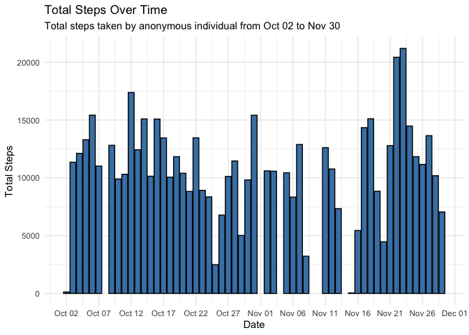
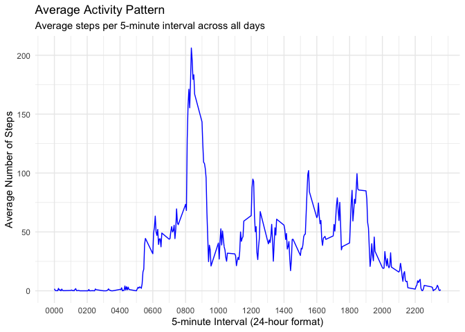
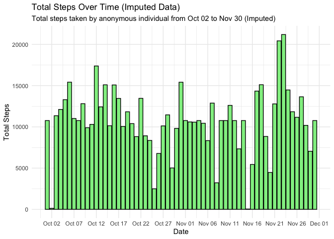
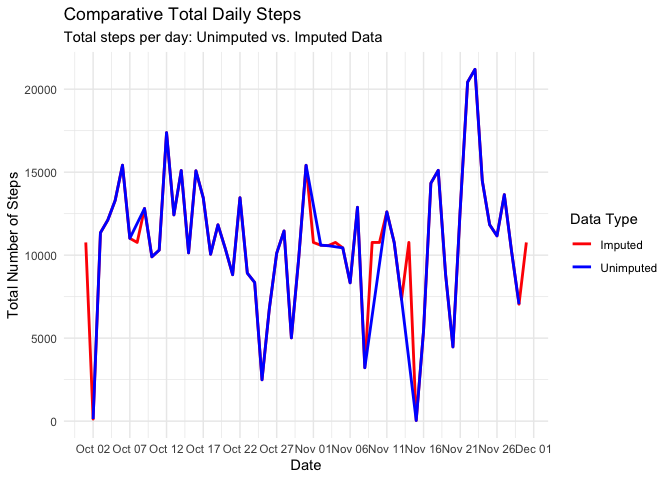
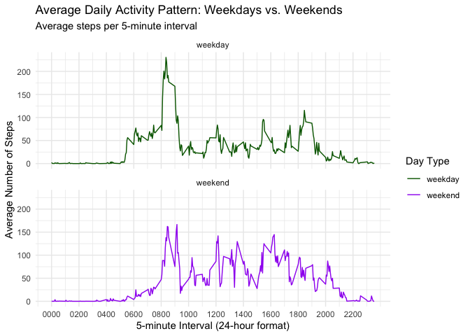
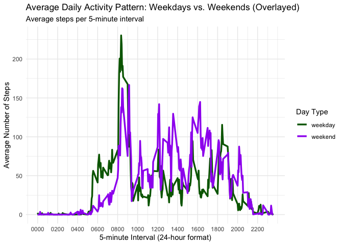

---

## Introduction

This report presents an analysis of personal activity monitoring data collected from an anonymous individual during **October and November 2012.** The data set, comprising 5-minute interval measurements, includes variables such as the number of steps taken, the date, and the specific 5-minute interval identifier.

The data set can be downloaded from: [Activity monitoring data](https://d396qusza40orc.cloudfront.net/repdata%2Fdata%2Factivity.zip)

The variables included in this data set are:

- **steps:** Number of steps taking in a 5-minute interval (missing values are coded as 
*NA*)

- **date:** The date on which the measurement was taken in YYYY-MM-DD format

- **interval:** Identifier for the 5-minute interval in which measurement was taken

This analysis aims to explore daily activity patterns, quantify total steps, investigate average daily activity trends, address missing data, and compare activity levels between weekdays and weekends.

The project emphasizes reproducible research practices. All data loading, processing, analysis, and visualization steps are conducted using R and documented within this R Markdown file. This ensures that the entire analysis can be fully replicated, promoting transparency and verifying the integrity of the findings presented herein.

---

#### Loading & Exploring the Data

This section outlines the initial steps taken to prepare the raw activity monitoring data for analysis. The dataset, provided as a CSV file, will first be loaded into R using the *fread* function.

To begin, the activity monitoring data is loaded directly into a data table using data.table::fread(). 


``` r
activityData <<- data.table::fread(file = "https://d396qusza40orc.cloudfront.net/repdata%2Fdata%2Factivity.zip")

head(activityData)
```

```
##    steps       date interval
##    <int>     <IDat>    <int>
## 1:    NA 2012-10-01        0
## 2:    NA 2012-10-01        5
## 3:    NA 2012-10-01       10
## 4:    NA 2012-10-01       15
## 5:    NA 2012-10-01       20
## 6:    NA 2012-10-01       25
```

A quick inspection of the *head* of the dataset reveals several NA values in the steps column, indicating missing observations. The date column is observed to be in IDate format, while the interval column is stored as an integer.


``` r
summary(activityData, na.rm = TRUE)
```

```
##      steps             date               interval     
##  Min.   :  0.00   Min.   :2012-10-01   Min.   :   0.0  
##  1st Qu.:  0.00   1st Qu.:2012-10-16   1st Qu.: 588.8  
##  Median :  0.00   Median :2012-10-31   Median :1177.5  
##  Mean   : 37.38   Mean   :2012-10-31   Mean   :1177.5  
##  3rd Qu.: 12.00   3rd Qu.:2012-11-15   3rd Qu.:1766.2  
##  Max.   :806.00   Max.   :2012-11-30   Max.   :2355.0  
##  NA's   :2304
```

A *summary* of the data set provides further insights. It shows that the minimum number of steps recorded in any 5-minute interval is 0, and the maximum is 806. We can also see that there are **2304 missing observations coded as NAs** in the steps column.

---

#### Pre-Processing

A crucial preprocessing step involves transforming the interval variable. Although currently stored as an integer (e.g., 0 for 12:00 AM, 2355 for 11:55 PM), it represents specific 5-minute time slots throughout the day in 24-hour format. 

To facilitate time-based analysis, this integer interval will be converted into a proper POSIX time-of-day format. Furthermore, the date variable will be combined with this newly formatted time to create a single, comprehensive POSIX date-time variable. This composite variable will enable seamless chronological ordering and temporal grouping for subsequent analyses and visualizations.

**1. Convert interval to 24-hour time string:** The interval column, which is an integer representing 5-minute intervals, is first converted into a four-digit character string (e.g., 0 becomes "0000", 2355 remains "2355"). This ensures consistency with a 24-hour time format, making it suitable for combination with the date column.


``` r
library(data.table)
library(chron)

# Convert all interval values to a 4 digit character vector corresponding to the 24-hour time

activityData[, interval := formatC(interval, width = 4, flag = "0")]
```

**2. Create Combined POSIX Date-Time Variable:** A new column named CombinedTimeStamps is created by concatenating the date and the formatted interval strings. This combined string is then converted into a POSIXct object using the specified format "%Y-%m-%d %H%M" and UTC timezone. This step is essential for accurate time-series analysis and allows for easy manipulation and aggregation of data based on precise timestamps.


``` r
activityData[ , ':='(CombinedTimeStamps = as.POSIXct(paste(date, interval), format = "%Y-%m-%d %H%M", tz = "UTC"))]

summary(activityData$CombinedTimeStamps)
```

```
##                  Min.               1st Qu.                Median 
## "2012-10-01 00:00:00" "2012-10-16 05:58:45" "2012-10-31 11:57:30" 
##                  Mean               3rd Qu.                  Max. 
## "2012-10-31 11:57:30" "2012-11-15 17:56:15" "2012-11-30 23:55:00"
```

The summary of CombinedTimeStamps confirms the successful conversion, showing the range of dates and times covered by the dataset, from October 1st, 2012 at 00:00:00, to November 30th, 2012 at 23:55:00.

---

#### What is the Mean Total Number of Steps Taken Per Day?

This section focuses on calculating and visualizing the total number of steps taken each day, along with deriving key summary statistics such as the mean and median. For this initial analysis, missing values in the steps column are ignored, and calculations are performed on the available data.

**1. Calculate the total number of steps taken per day:** The steps data is aggregated by date to determine the sum of steps for each day. Missing values are excluded from this summation.


``` r
totalPerDay <- aggregate(steps ~ date, activityData, sum, na.rm=TRUE)
```

**2. Calculate the mean and median of the total number of steps taken per day:** A summary of the totalPerDay data set is generated to provide a quick overview of the daily step counts. Subsequently, the mean and median of the steps column from this aggregated data are computed and reported.


``` r
summary(totalPerDay)
```

```
##       date                steps      
##  Min.   :2012-10-02   Min.   :   41  
##  1st Qu.:2012-10-16   1st Qu.: 8841  
##  Median :2012-10-29   Median :10765  
##  Mean   :2012-10-30   Mean   :10766  
##  3rd Qu.:2012-11-16   3rd Qu.:13294  
##  Max.   :2012-11-29   Max.   :21194
```

``` r
mean(totalPerDay$steps)
```

```
## [1] 10766.19
```

``` r
median(totalPerDay$steps)
```

```
## [1] 10765
```
The calculations reveal the overall central tendency of daily activity for the anonymous individual.

**3. Histogram of Total Steps Per Day:** A bar plot is generated to visualize the total number of steps taken each day. This plot provides a visual representation of the distribution of daily step counts over the observed period from Oct 02 to Nov 30.


``` r
library(ggplot2)
ggplot(totalPerDay, aes(x = date, y = steps)) +
    geom_bar(stat = "identity", fill = "steelblue", color = "black") +
    scale_x_date(date_labels = "%b %d", date_breaks = "5 days") +
    labs(title = "Total Steps Over Time", subtitle = "Total steps taken by anonymous individual from Oct 02 to Nov 30", x = "Date", y = "Total Steps") +
    theme_minimal() # Use a minimal theme for a clean look
```

<!-- -->

---

#### What is the Average Daily Activity Pattern?

This section investigates the typical daily activity pattern by calculating the average number of steps taken across all days for each 5-minute interval. This allows for the identification of periods of peak activity throughout a typical day.

**1. Calculate the average number of steps per 5-minute interval:** The steps data is aggregated by interval to compute the mean number of steps for each unique 5-minute interval, averaged across all days in the data set. Missing values are excluded from this calculation to ensure the average reflects actual recorded steps.


``` r
meanPerInterval <- aggregate(steps ~ interval, activityData, mean, na.rm=TRUE)
```

**2. Time series plot of average steps per 5-minute interval:** A time series plot will be generated to visualize this average daily activity pattern. The x-axis will represent the 5-minute intervals (time of day), and the y-axis will display the average number of steps taken during those intervals. This plot will clearly illustrate how activity levels fluctuate throughout a typical day.


``` r
ggplot(meanPerInterval, aes(x = as.numeric(interval), y = steps)) +
    geom_line(color = "blue") +
    labs(title = "Average Activity Pattern",
         subtitle = "Average steps per 5-minute interval across all days",
         x = "5-minute Interval (24-hour format)",
         y = "Average Number of Steps") +
    theme_minimal() +
    scale_x_continuous(breaks = seq(0, 2355, by = 200), labels = sprintf("%04d", seq(0, 2355, by = 200)))
```

<!-- -->

**3. Identify the 5-minute interval with the maximum average steps:** From the aggregated data of average steps per interval, the interval that, on average, contains the highest number of steps will be identified and reported. This pinpoint the period of most intense activity.


``` r
meanPerInterval[which.max(meanPerInterval$steps),]
```

```
##     interval    steps
## 104     0835 206.1698
```

##### Which 5-minute interval, on average across all the days in the data set, contains the maximum number of steps?

The anonymous individual takes the most amount of steps on average at **0835 each day.**

---

#### Imputing Missing Values

The presence of missing values (*coded as __NA__*) within the data set can introduce bias into statistical calculations and summaries. This section addresses these missing observations by devising and implementing a strategy for imputation.

**1. Calculate the total number of missing values in the data set:** The first step involves quantifying the extent of missing data by determining the total count of *NA values* in the *steps* column of the original data set.


``` r
totalMissingValues <- sum(is.na(activityData$steps))
print(paste("Total missing values in 'steps' column:", totalMissingValues))
```

```
## [1] "Total missing values in 'steps' column: 2304"
```

**2. Fill in the missing values with the mean for that day:** For each missing entry, the missing value will be replaced with the mean number of steps for the specific 5-minute interval across all available days. This approach aims to preserve the typical activity pattern for that time slot.

**Create a new data set with imputed values:** A new data set will be created, which is a copy of the original activity data but with all the NA values in the steps column replaced using the imputation strategy described above.


``` r
# Create a new data set for imputation
imputedActivityData <- data.table::copy(activityData)

# Loop through each row to impute missing values
for (i in 1:nrow(imputedActivityData)) {
    if (is.na(imputedActivityData$steps[i])) {
        # Replace NA with the mean for that 5 minute interval
        imputedActivityData$steps[i] <- meanPerInterval$steps[meanPerInterval$interval == imputedActivityData$interval[i]]
    }
}
```

**3. Histogram of total steps taken each day with imputed values:** This histogram shows the total number of steps taken each day after the missing values have been imputed.


``` r
# Calculate total steps per day for the imputed data
totalPerDayImputed <- aggregate(steps ~ date, imputedActivityData, sum)

# Generate the histogram
ggplot(totalPerDayImputed, aes(x = date, y = steps)) +
    geom_bar(stat = "identity", fill = "lightgreen", color = "black") +
    scale_x_date(date_labels = "%b %d", date_breaks = "5 days") +
    labs(title = "Total Steps Over Time (Imputed Data)",
         subtitle = "Total steps taken by anonymous individual from Oct 02 to Nov 30 (Imputed)",
         x = "Date", y = "Total Steps") +
    theme_minimal()
```

<!-- -->

**4. Mean and median of total steps taken per day with imputed values:** The mean and median of the total daily steps will be calculated and reported for the new data set containing the imputed values.


``` r
summary(imputedActivityData)
```

```
##      steps             date              interval        
##  Min.   :  0.00   Min.   :2012-10-01   Length:17568      
##  1st Qu.:  0.00   1st Qu.:2012-10-16   Class :character  
##  Median :  0.00   Median :2012-10-31   Mode  :character  
##  Mean   : 37.38   Mean   :2012-10-31                     
##  3rd Qu.: 27.00   3rd Qu.:2012-11-15                     
##  Max.   :806.00   Max.   :2012-11-30                     
##  CombinedTimeStamps           
##  Min.   :2012-10-01 00:00:00  
##  1st Qu.:2012-10-16 05:58:45  
##  Median :2012-10-31 11:57:30  
##  Mean   :2012-10-31 11:57:30  
##  3rd Qu.:2012-11-15 17:56:15  
##  Max.   :2012-11-30 23:55:00
```

``` r
summary(totalPerDayImputed)
```

```
##       date                steps      
##  Min.   :2012-10-01   Min.   :   41  
##  1st Qu.:2012-10-16   1st Qu.: 9819  
##  Median :2012-10-31   Median :10766  
##  Mean   :2012-10-31   Mean   :10766  
##  3rd Qu.:2012-11-15   3rd Qu.:12811  
##  Max.   :2012-11-30   Max.   :21194
```

``` r
mean(totalPerDayImputed$steps)
```

```
## [1] 10766.19
```

``` r
median(totalPerDayImputed$steps)
```

```
## [1] 10766.19
```

---

#### Do these values differ from the estimates from the original summary?
Following the calculation of the mean and median from the imputed data, a comparative analysis will be conducted to determine how these values differ from the estimates obtained in the initial summary (where missing values were ignored).

**1. Tabular Comparison of Mean and Median Daily Steps:** A knitr table will be presented to directly compare the mean and median total number of steps per day from the unimputed data with those from the imputed data. This table will clearly highlight any shifts in these central tendency measures due to imputation.


``` r
library(knitr)

# Create a data table for comparison
comparison_data <- data.table(
    Statistic = c("Mean Total Steps", "Median Total Steps"),
    Unimputed_Data = c(mean(totalPerDay$steps), 
                       median(totalPerDay$steps)),
    Imputed_Data = c(mean(totalPerDayImputed$steps), 
                     median(totalPerDayImputed$steps))
)

# Print the table
kable(comparison_data, caption = "Comparison of Daily Steps: Unimputed vs. Imputed Data")
```


Table: Comparison of Daily Steps: Unimputed vs. Imputed Data

|Statistic          | Unimputed_Data| Imputed_Data|
|:------------------|--------------:|------------:|
|Mean Total Steps   |       10766.19|     10766.19|
|Median Total Steps |       10765.00|     10766.19|

**2. Comparative Time Series Plot of Average Daily Activity:** A single time series line graph will be generated to compare the total daily activity pattern between the unimputed and imputed data sets. This plot will feature two distinct lines, each in a different color, representing the total steps per day for both the original and the imputed data. This visualization will allow for a direct visual assessment of how imputation affects the total daily activity.


``` r
# Ensure totalPerDay and totalPerDayImputed are available from previous sections

# Add a 'type' column to differentiate unimputed and imputed total daily steps
totalPerDay$type <- "Unimputed"
totalPerDayImputed$type <- "Imputed"

# Combine both total daily steps dataframes for plotting
combinedTotalPerDay <- rbind(totalPerDay, totalPerDayImputed)

# Generate the comparative time series plot for total steps per day
ggplot(combinedTotalPerDay, aes(x = date, y = steps, color = type)) +
    geom_line(size = 1) + # Use geom_line for time series of total steps
    labs(title = "Comparative Total Daily Steps",
         subtitle = "Total steps per day: Unimputed vs. Imputed Data",
         x = "Date",
         y = "Total Number of Steps",
         color = "Data Type") +
    theme_minimal() +
    scale_x_date(date_labels = "%b %d", date_breaks = "5 days") + # Use scale_x_date for dates
    scale_color_manual(values = c("Unimputed" = "blue", "Imputed" = "red")) # Assign distinct colors
```

```
## Warning: Using `size` aesthetic for lines was deprecated in ggplot2 3.4.0.
## ℹ Please use `linewidth` instead.
## This warning is displayed once every 8 hours.
## Call `lifecycle::last_lifecycle_warnings()` to see where this warning was
## generated.
```

<!-- -->

**3. Side-by-Side Comparison of Most Active Intervals:** The 5-minute intervals that, on average, contain the maximum number of steps will be identified and presented side-by-side for both the unimputed and imputed datasets. This comparison will show whether the imputation strategy alters the identified peak activity periods.


``` r
meanPerIntervalImputed <- aggregate(steps ~ interval, imputedActivityData, mean)

# Most active interval from unimputed data (already calculated as maxInterval)
print("Most active interval (Unimputed Data):")
```

```
## [1] "Most active interval (Unimputed Data):"
```

``` r
print(meanPerInterval[which.max(meanPerInterval$steps),])
```

```
##     interval    steps
## 104     0835 206.1698
```

``` r
# Most active interval from imputed data
print("Most active interval (Imputed Data):")
```

```
## [1] "Most active interval (Imputed Data):"
```

``` r
print(meanPerIntervalImputed[which.max(meanPerIntervalImputed$steps),])
```

```
##     interval    steps
## 104     0835 206.1698
```

---

#### What is the impact of imputing missing data on the estimates of the total daily number of steps?
The imputation strategy involved replacing missing steps values with the mean for their respective 5-minute intervals, and had a subtle but notable impact on the overall daily step estimates. As observed from the tabular comparison, the **mean total steps per day** remained identical between the unimputed and imputed datasets *(10766.19 for both)*. The **median total steps per day** showed a minimal change, moving from *10765.00 in the unimputed data to 10766.19 in the imputed data.* 

This close proximity in central tendency measures suggests that the imputation method effectively filled gaps without drastically skewing the overall daily averages.

Visually, the comparative time series plot demonstrates that the overall pattern and magnitude of total daily steps **remain largely consistent** between the two data sets. 

This indicates that the imputation preserved the general trend of daily activity. Furthermore, the most active 5-minute interval (0835) remained unchanged after imputation for both the unimputed and imputed datasets.

In conclusion, while imputation explicitly addressed the missing data points, its impact on the estimates of the total daily number of steps was minimal for this particular data set and imputation strategy. 

The chosen method successfully maintained the underlying daily activity patterns and aggregate statistics, providing a more complete data set for analysis without introducing significant artificial inflation or deflation of daily step counts.

---

#### Are there differences in Activity Patterns between Weekdays & Weekends?

This section explores whether there are discernible differences in activity patterns between weekdays and weekends. Understanding this distinction can provide insights into how daily routines might vary. This analysis will utilize the imputedActivityData to ensure a complete dataset.

**1. Create a new factor variable for "weekday" or "weekend":** A new factor variable will be created within the imputedActivityData to categorize each date as either a "weekday" or a "weekend". The weekdays() function in R will be helpful for this classification.


``` r
# Ensure imputedActivityData is available

# Create a new factor variable 'dayType'
imputedActivityData[, dayType := ifelse(weekdays(date) %in% c("Saturday", "Sunday"), "weekend", "weekday")]

# Convert 'dayType' to a factor
imputedActivityData[, dayType := factor(dayType, levels = c("weekday", "weekend"))]

# Verify the new variable
print(imputedActivityData[, .N, by = dayType])
```

```
##    dayType     N
##     <fctr> <int>
## 1: weekday 12960
## 2: weekend  4608
```

**2. Make a panel plot comparing average steps across weekdays and weekends:** The panel plot below shows the average number of steps taken per 5-minute interval, separated by "weekday" and "weekend". This will be a time series plot where the x-axis represents the 5-minute intervals and the y-axis shows the average steps. The use of facet_wrap(~ dayType) in ggplot2 will create separate panels for weekdays and weekends, allowing for a clear visual comparison of their activity patterns.


``` r
# Calculate average steps per interval for weekdays and weekends
averageDailyPatternByDayType <- aggregate(steps ~ interval + dayType, imputedActivityData, mean)

# Ensure 'interval' is numeric for plotting
averageDailyPatternByDayType$interval <- as.numeric(averageDailyPatternByDayType$interval)

# Create the panel plot
ggplot(averageDailyPatternByDayType, aes(x = interval, y = steps, color = dayType)) +
    geom_line() +
    facet_wrap(~ dayType, ncol = 1) + # Create separate panels for weekday and weekend
    labs(title = "Average Daily Activity Pattern: Weekdays vs. Weekends",
         subtitle = "Average steps per 5-minute interval",
         x = "5-minute Interval (24-hour format)",
         y = "Average Number of Steps",
         color = "Day Type") +
    theme_minimal() +
    scale_x_continuous(breaks = seq(0, 2355, by = 200), labels = sprintf("%04d", seq(0, 2355, by = 200))) +
    scale_color_manual(values = c("weekday" = "darkgreen", "weekend" = "purple")) # Assign distinct colors
```

<!-- -->

**3. Overlayed plot comparing average steps across weekdays and weekends:** To directly compare the activity patterns on a single graph, the average steps per 5-minute interval for weekdays and weekends will be plotted on the same axes. This allows for an immediate visual assessment of their differences and similarities.


``` r
# Data for this plot is already prepared in averageDailyPatternByDayType

ggplot(averageDailyPatternByDayType, aes(x = interval, y = steps, color = dayType)) +
    geom_line(size = 1.2) + # Add size for better visibility of lines
    labs(title = "Average Daily Activity Pattern: Weekdays vs. Weekends (Overlayed)",
         subtitle = "Average steps per 5-minute interval",
         x = "5-minute Interval (24-hour format)",
         y = "Average Number of Steps",
         color = "Day Type") +
    theme_minimal() +
    scale_x_continuous(breaks = seq(0, 2355, by = 200), labels = sprintf("%04d", seq(0, 2355, by = 200))) +
    scale_color_manual(values = c("weekday" = "darkgreen", "weekend" = "purple")) # Use distinct colors
```

<!-- -->

Visually, the overlayed plot clearly illustrates distinct patterns between weekday and weekend activity. 

The individual tends to exhibit higher activity levels during earlier morning hours on weekdays, specifically from approximately 0600 to 0900. 

In contrast, activity on weekends appears to be shifted later in the day, with a noticeable increase in steps between 1000 and 1630 compared to weekdays. 

This suggests a pattern where weekday activity is driven by an earlier routine, potentially related to work or daily commutes, while weekend activity is more spread out and concentrated in the late morning and afternoon, possibly indicative of more leisure-based movement.

---
